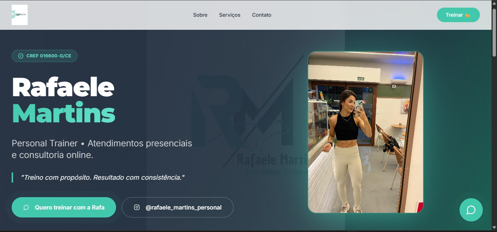
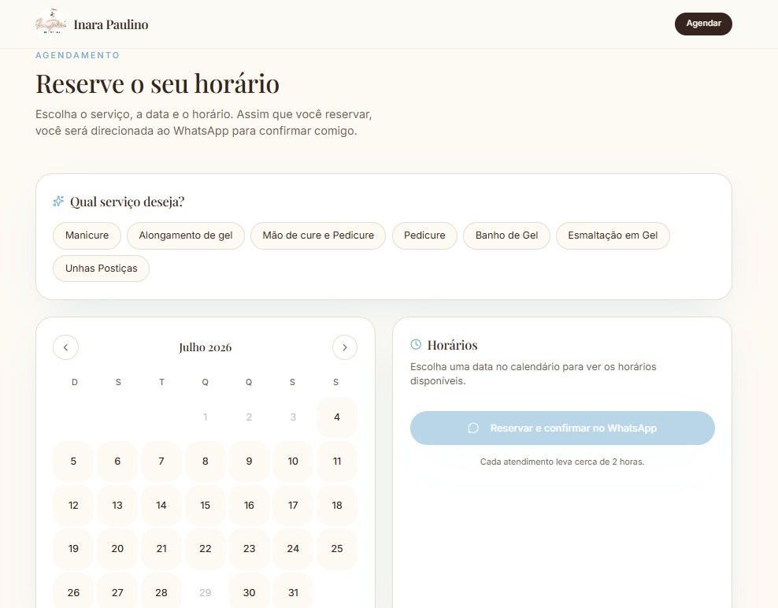

# Olá, eu sou o Gustavo! 👋

Estudante de TI na UFC, desenvolvimento Web e Mobile. Atualmente focado em criar soluções eficientes com React, TypeScript.

## 🚀 Projetos em Destaque

### 🏋️‍♀️ Landing Page - Rafaele Martins (Personal Trainer)
Desenvolvimento de uma página para clientes da profissional, focada em conversão e agendamentos.
- **Tecnologias:** React, Vite, Tailwind CSS, shadcn/ui.
- **Destaque:** Interface totalmente responsiva e integração direta com WhatsApp e galeria de resultados otimizadas.
- **Projeto:** [Link do projeto] : https://rafaele-martins-personal.vercel.app/
- *(Código privado por questões de privacidade da cliente)*
- 

  

### 🏋️‍♀️ Landing Page - Lara Macedo (Personal Treiner)
Desenvolvimento de uma página focada em consultoria de alta performance e resultados.
- **Tecnologias:** React, Vite, Tailwind CSS, shadcn/ui.
- **Destaque:** Galeria de resultados otimizada e design focado em conversão.
- **Projeto: [Link do projeto]** : https://lara-marcedo-performance.vercel.app/
- *(Código privado por questões de privacidade da cliente)*

  

###  Landing Page - Inara Paulino (Nail Designer)
Desenvolvimento de uma página para clientes da profissional, com sistema de agendamento integrado.
- **Tecnologias:** React, TypeScript, Vite, Tailwind CSS, Supabase
- **Destaque:** Sistema de agendamento com calendário interativo, verificação de horários disponíveis em tempo real e confirmação direta via WhatsApp
- **Projeto: [Link do projeto]:** https://inara-unhas.vercel.app/
- *(Código privado por questões de privacidade da cliente)*

  

---
## 🛠️ Habilidades Técnicas
- **Linguagens:** TypeScript, JavaScript, Java, Python, Rust.
- **Frameworks/Libs:** React, Next.js, Material UI.
- **Ferramentas:** Git, GitHub Codespaces, Vercel, MySQL, Supabase.

